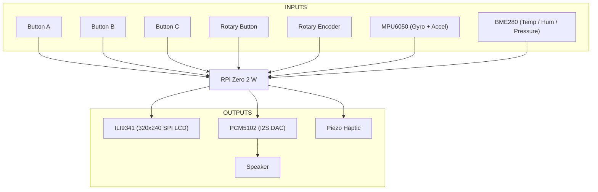

# osga-shield


An open hardware platform for creative coding and generative art, designed to work with the [OSGA software platform](https://github.com/kurogedelic/osga).

## Project Structure

```
osga-shield/
├── CLAUDE.md              # Complete setup guide and troubleshooting
├── PROJECT_STRUCTURE.md   # Detailed project organization
├── firmware/              # Raspberry Pi OS configuration and software
│   ├── install.sh        # Complete installation script
│   ├── boot/             # Boot configuration files
│   ├── config/           # System configurations (ALSA, Grove I2C)
│   ├── scripts/          # Hardware initialization scripts
│   └── systemd/          # Auto-start service definitions
├── hardware/              # Hardware design files
│   ├── kicad/            # KiCad schematic and PCB layout
│   ├── bom/              # Bill of Materials
│   ├── fabrication/      # Gerber files for PCB manufacturing
│   └── 3d-models/        # 3D models for enclosure
└── README.md             # This file - project overview
```

📋 See [PROJECT_STRUCTURE.md](PROJECT_STRUCTURE.md) for detailed organization guide.  
🔧 See [CLAUDE.md](CLAUDE.md) for complete setup instructions and troubleshooting.

## Overview

osga-shield is a Raspberry Pi shield that provides a complete hardware interface for audio-visual creative applications. It features physical controls, motion sensing, environmental monitoring, and high-quality audio output.

## Hardware Architecture



## Specifications

### Display
- **Controller**: ILI9341
- **Resolution**: 320x240 pixels
- **Interface**: SPI
- **Color**: 16-bit RGB

### Audio
- **DAC**: PCM5102A (I2S)
- **Output**: 3.5mm stereo jack + built-in speaker
- **Sample Rate**: Up to 384kHz
- **Bit Depth**: 32-bit

### Input Controls
- **Buttons**: 2x tactile switches (A, B)
- **Rotary Encoder**: With push button function (Enter)
- **Motion**: MPU6050 6-axis IMU (3-axis gyro + 3-axis accelerometer)

### Expansion
- **Grove Connector**: I²C expansion port for additional sensors/modules
  - Compatible with Seeed Studio Grove ecosystem
  - 3.3V/5V power selectable

### Feedback
- **Haptic**: Piezo element for tactile feedback
- **Visual**: SPI LCD display

### Processing
- **Platform**: Raspberry Pi Zero 2 W
- **Connectivity**: WiFi, Bluetooth

## Pin Mapping (Raspberry Pi Zero 2 WH)

### I²C Buses
| Bus | Component | GPIO Pin | Physical Pin | Function |
|-----|-----------|----------|--------------|----------|
| I²C1 | MPU_SDA | GPIO 2 | Pin 3 | MPU6050 Data |
| I²C1 | MPU_SCL | GPIO 3 | Pin 5 | MPU6050 Clock |
| I²C (SW) | Grove_SDA | GPIO 22 | Pin 15 | Grove Connector Data |
| I²C (SW) | Grove_SCL | GPIO 23 | Pin 16 | Grove Connector Clock |

### Audio (I²S)
| Component | GPIO Pin | Physical Pin | Function |
|-----------|----------|--------------|----------|
| I2S_BCK | GPIO 18 | Pin 12 | Bit Clock |
| I2S_LRCK | GPIO 19 | Pin 35 | Left/Right Clock |
| I2S_IN | GPIO 20 | Pin 38 | Audio Input |
| I2S_OUT | GPIO 21 | Pin 40 | Audio Output (to PCM5102) |

### Display (SPI)
| Component | GPIO Pin | Physical Pin | Function |
|-----------|----------|--------------|----------|
| LCD_CS | GPIO 8 (CE0) | Pin 24 | Chip Select |
| LCD_MISO | GPIO 9 | Pin 21 | Master In Slave Out |
| LCD_MOSI | GPIO 10 | Pin 19 | Master Out Slave In |
| LCD_SCLK | GPIO 11 | Pin 23 | Serial Clock |
| LCD_DC | GPIO 24 | Pin 18 | Data/Command |
| LCD_RESET | GPIO 25 | Pin 22 | Reset |
| LCD_LED | GPIO 12 | Pin 32 | Backlight PWM |

### Input Controls
| Component | GPIO Pin | Physical Pin | Function |
|-----------|----------|--------------|----------|
| Button_A | GPIO 6 | Pin 31 | Button A |
| Button_B | GPIO 5 | Pin 29 | Button B |
| Rotary_CLK | GPIO 16 | Pin 36 | Encoder Clock |
| Rotary_DT | GPIO 13 | Pin 33 | Encoder Data |
| Rotary_Enter | GPIO 26 | Pin 37 | Encoder Button |

### UART (Debug)
| Component | GPIO Pin | Physical Pin | Function |
|-----------|----------|--------------|----------|
| UART_TX | GPIO 14 | Pin 8 | Transmit |
| UART_RX | GPIO 15 | Pin 10 | Receive |

## Software Support

The osga-shield is designed to work seamlessly with:
- **[OSGA](https://github.com/kurogedelic/osga)**: Open Sound & Graphics Appliance platform
- **Raspberry Pi OS**: Standard Linux support
- **Love2D**: For creative coding applications
- **Python**: Via GPIO and device libraries

## Getting Started

1. **Hardware Assembly**
   - Mount the shield on a Raspberry Pi Zero 2 W
   - Connect speaker or headphones to audio output
   - Power via micro USB

2. **Software Installation**
   ```bash
   # Flash Raspberry Pi OS Lite to SD card
   # Boot the Pi and clone this repository
   git clone https://github.com/kurogedelic/osga-shield.git
   cd osga-shield/firmware
   
   # Run installation script
   sudo ./install.sh
   
   # System will reboot and start OSGA automatically
   ```

3. **Test Hardware**
   - Run the hardware test app from OSGA launcher
   - Verify all buttons, encoder, and sensors work

## Development

### Creating Apps
See the [OSGA documentation](https://github.com/kurogedelic/osga#creating-an-app) for app development guidelines.

### Hardware Libraries
- **Python**: Use `RPi.GPIO`, `smbus2` for I2C devices
- **C/C++**: Use `wiringPi` or direct register access
- **Love2D**: Via OSGA's hardware abstraction layer

## License

This hardware design is open source. Schematics and PCB designs will be released under:
- **Hardware**: CERN Open Hardware License v2
- **Software**: LGPL v3 (matching OSGA platform)

## Credits

Designed by Leo Kuroshita from Hugelton Instruments (2025)

## Contributing

Contributions are welcome! Please submit issues and pull requests for:
- Hardware improvements
- Documentation updates
- Example projects
- Bug fixes

## Related Projects

- **[OSGA](https://github.com/kurogedelic/osga)**: The software platform
- **[osga-apps](https://github.com/kurogedelic/osga-apps)**: Community-contributed applications
