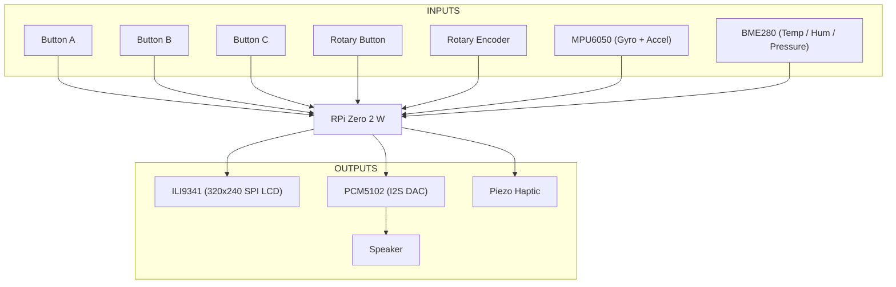

# osga-shield

An open hardware platform for creative coding and generative art, designed to work with the [OSGA software platform](https://github.com/kurogedelic/osga).

## Overview

osga-shield is a Raspberry Pi shield that provides a complete hardware interface for audio-visual creative applications. It features physical controls, motion sensing, environmental monitoring, and high-quality audio output.

## Hardware Architecture



## Specifications

### Display
- **Controller**: ILI9341
- **Resolution**: 320x240 pixels
- **Interface**: SPI
- **Color**: 16-bit RGB

### Audio
- **DAC**: PCM5102A (I2S)
- **Output**: 3.5mm stereo jack + built-in speaker
- **Sample Rate**: Up to 384kHz
- **Bit Depth**: 32-bit

### Input Controls
- **Buttons**: 3x tactile switches (A, B, C)
- **Rotary Encoder**: With push button function
- **Motion**: MPU6050 6-axis IMU (3-axis gyro + 3-axis accelerometer)

### Sensors
- **Environmental**: BME280
  - Temperature: -40 to +85°C
  - Humidity: 0-100% RH
  - Pressure: 300-1100 hPa

### Feedback
- **Haptic**: Piezo element for tactile feedback
- **Visual**: SPI LCD display

### Processing
- **Platform**: Raspberry Pi Zero 2 W
- **Connectivity**: WiFi, Bluetooth

## Pin Mapping

| Component | GPIO Pin | Function |
|-----------|----------|----------|
| Button A | GPIO 5 | Digital Input (Pull-up) |
| Button B | GPIO 6 | Digital Input (Pull-up) |
| Button C | GPIO 13 | Digital Input (Pull-up) |
| Rotary CLK | GPIO 17 | Rotary Encoder Clock |
| Rotary DT | GPIO 27 | Rotary Encoder Data |
| Rotary SW | GPIO 22 | Rotary Encoder Switch |
| LCD CS | GPIO 8 | SPI Chip Select |
| LCD DC | GPIO 25 | Data/Command |
| LCD RST | GPIO 24 | Reset |
| I2S BCK | GPIO 18 | Bit Clock |
| I2S LRCK | GPIO 19 | Left/Right Clock |
| I2S DATA | GPIO 21 | Audio Data |
| I2C SDA | GPIO 2 | I2C Data (MPU6050, BME280) |
| I2C SCL | GPIO 3 | I2C Clock |
| Haptic | GPIO 12 | PWM Output |

## Software Support

The osga-shield is designed to work seamlessly with:
- **[OSGA](https://github.com/kurogedelic/osga)**: Open Sound & Graphics Appliance platform
- **Raspberry Pi OS**: Standard Linux support
- **Love2D**: For creative coding applications
- **Python**: Via GPIO and device libraries

## Getting Started

1. **Hardware Assembly**
   - Mount the shield on a Raspberry Pi Zero 2 W
   - Connect speaker or headphones to audio output
   - Power via micro USB

2. **Software Setup**
   ```bash
   # Clone OSGA platform
   git clone https://github.com/kurogedelic/osga.git
   cd osga
   
   # Install Love2D
   sudo apt-get update
   sudo apt-get install love2d
   
   # Run OSGA
   love osga-run
   ```

3. **Test Hardware**
   - Run the hardware test app from OSGA launcher
   - Verify all buttons, encoder, and sensors work

## Development

### Creating Apps
See the [OSGA documentation](https://github.com/kurogedelic/osga#creating-an-app) for app development guidelines.

### Hardware Libraries
- **Python**: Use `RPi.GPIO`, `smbus2` for I2C devices
- **C/C++**: Use `wiringPi` or direct register access
- **Love2D**: Via OSGA's hardware abstraction layer

## License

This hardware design is open source. Schematics and PCB designs will be released under:
- **Hardware**: CERN Open Hardware License v2
- **Software**: LGPL v3 (matching OSGA platform)

## Credits

Designed by Leo Kuroshita from Hugelton Instruments (2025)

## Contributing

Contributions are welcome! Please submit issues and pull requests for:
- Hardware improvements
- Documentation updates
- Example projects
- Bug fixes

## Related Projects

- **[OSGA](https://github.com/kurogedelic/osga)**: The software platform
- **[osga-apps](https://github.com/kurogedelic/osga-apps)**: Community-contributed applications